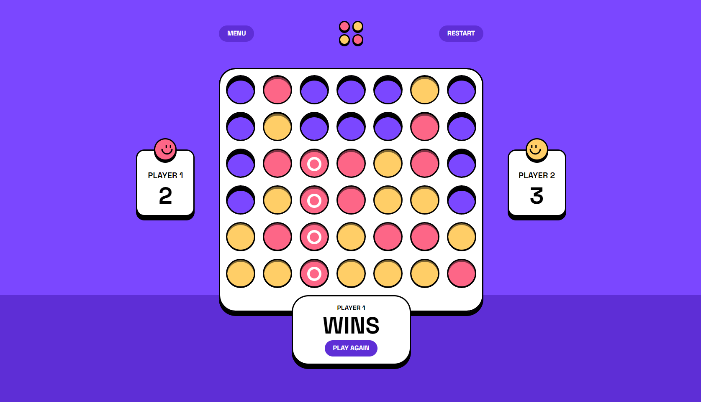

## Table of contents

- [The challenge](#the-challenge)
- [Screenshot](#screenshot)
- [Links](#links)
- [Built with](#built-with)
- [Author](#author)

## Overview
Be the first player to connect 4 of the same colored discs in a row (either vertically, horizontally, or diagonally).

### The challenge

Users should be able to:

- View the game rules
- Play a game of Connect Four against another human player (alternating turns on the same computer)
- View the optimal layout for the interface depending on their device's screen size
- See hover and focus states for all interactive elements on the page
- See the discs animate into their position when a move is made
- **Bonus**: Play against the computer

### Screenshot

### Links

- Solution URL: [Add solution URL here](https://github.com/olha-leskiv/js-projects/tree/main/connect-four-game)
- Live Site URL: [Add live site URL here](https://olha-leskiv.github.io/js-projects/connect-four-game/index.html)

### Built with

- Semantic HTML5 markup
- SCSS/SASS
- jQuery

## Author

- Frontend Portfolio - [Olha Leskiv](https://olha-leskiv.github.io/js-projects/)
- Design Portfolio - [Olha Leskiv](https://olha-leskiv.github.io/js-projects/)