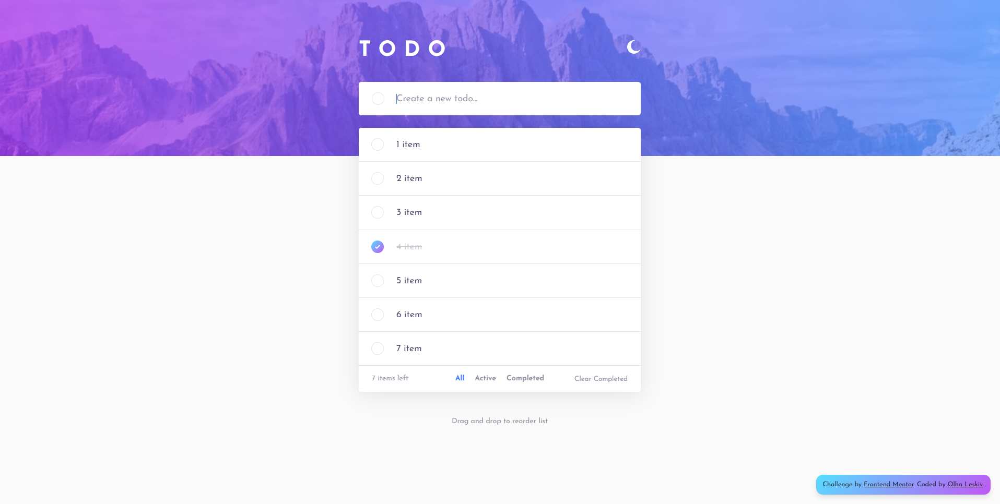

# Frontend Mentor - Todo app solution

This is a solution to the [Todo app challenge on Frontend Mentor](https://www.frontendmentor.io/challenges/todo-app-Su1_KokOW). Frontend Mentor challenges help you improve your coding skills by building realistic projects. 

## Table of contents

- [The challenge](#the-challenge)
- [Screenshot](#screenshot)
- [Links](#links)
- [My process](#my-process)
- [Built with](#built-with)
- [What I learned](#what-i-learned)
- [Author](#author)


### The challenge

Users should be able to:

- View the optimal layout for the app depending on their device's screen size
- See hover states for all interactive elements on the page
- Add new todos to the list
- Mark todos as complete
- Delete todos from the list
- Filter by all/active/complete todos
- Clear all completed todos
- Toggle light and dark mode
- Drag and drop to reorder items on the list

### Screenshot



### Links

- Solution URL: [https://github.com/olha-leskiv/js-projects/tree/main/todo-app-main](https://github.com/olha-leskiv/js-projects/tree/main/todo-app-main)
- Live Site URL: [https://olha-leskiv.github.io/js-projects/todo-app-main/index.html](https://olha-leskiv.github.io/js-projects/todo-app-main/index.html)

## My process

Initially, I developed the markup and applied a comprehensive set of CSS styles, while ensuring smooth transitions and responsive behavior. Next, I proceeded to implement the core logic and additional features. During this process, I encountered challenges with the auto-resizing functionality of the textarea and the development of a custom drag-and-drop feature. Nonetheless, I was able to successfully overcome these obstacles and achieve a satisfactory result.

### Built with

- Semantic HTML5 markup
- CSS custom properties
- Pure Javascript


### What I learned

Highlighting the potential drop zone was a fascinating challenge, as it required predicting the user's intended destination even when they changed the direction of their mouse movements. To address this, I implemented a solution that involved monitoring the Y position of the mouse and comparing it to its position 100ms before (standard drag event interval appearance). Through this approach, I was able to accurately determine the most likely destination of the drag action and provide the appropriate highlighting accordingly.

```js

let prevScreenY = null;
let currentScreenY = null;

let higlightLine = document.createElement('div');
higlightLine.className = 'highlight';

function highlight(e) {
    currentScreenY =  e.screenY;
    let itemDragOver = e.currentTarget;
    if(prevScreenY > e.screenY + 2) {
        itemDragOver.before(higlightLine);
    } else if(prevScreenY < e.screenY - 2) {
        itemDragOver.after(higlightLine);
    }
}

function drag(e) {
    let item = e.target;
    hide(item);
    draggingItem = item;
    prevScreenY = currentScreenY;
}

```

## Author

- Frontend Portfolio - [Olha Leskiv](https://olha-leskiv.github.io/js-projects/)
- Design Portfolio - [Olha Leskiv](https://olha-leskiv.github.io/js-projects/)
- Frontend Mentor - [@yourusername](https://www.frontendmentor.io/profile/yourusername)
- Twitter - [@yourusername](https://www.twitter.com/yourusername)
